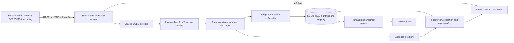

# Sentinel: registry, video analytics and vehicle investigation

## Problem and model choice

Separate departmental CCTV systems make inventory, viewing and vehicle investigation fragmented. This implementation combines the compulsory registry/GIS foundation with direct feed aggregation (Model 1 + Model 2). Existing departmental VMS and recordings remain operational. The platform stores investigation metadata and selected evidence crops rather than claiming to replace all departmental recording infrastructure.

## Implemented architecture

The application is a FastAPI service with camera worker threads. It is not a deployed microservice cluster. Detection model weights are shared, while tracker objects and recognition sessions are separate per camera. Vehicle inference is serialized for a conservative single-GPU baseline; OCR has its own lock. Media PTS drives motion intervals and expiry, with resets for regressions, scene cuts and reconnects. Original camera timestamps must be available to claim original capture time; recordings can be configured with their known UTC start time and media offset. Otherwise stream observations are labelled PTS_ESTIMATED_UTC, anchored to initial reception rather than verified capture time.

The database uses a fixed, configurable path independent of launch directory. Sighting and matching alert writes form one transaction. A session/track unique index prevents duplicate persistence during retries; a new camera session permits a new observation for reused tracker IDs. Uncertain observations never create confirmed-match alerts. A plate is confirmed after agreement from at least two separate qualified source frames. This score is not a calibrated probability of identity.

## Registry and source adapters

Registry fields cover camera identity, location/district, department, ownership, camera type, source system, source protocol/path, source provenance, coordinates and their provenance, storage/retention, maintenance status and recording start time. Manual and CSV input are validated; camera imports validate the entire file before database writes. Stream credentials are preserved privately and redacted from registry responses.

Implemented ingress supports RTSP/RTSPS where the installed decoder supports it, HTTP(S) video streams supported by OpenCV/FFmpeg, and recorded files under the media root. A file does not silently substitute for an unavailable network stream. Recorded EOF is explicit and a restart begins a new tracker session. Source metadata is never fabricated from a fixed camera count.

Analog-camera integration is through the authorized DVR/NVR/VMS output, not a direct analog connection. ONVIF discovery, proprietary SDK integration, PTZ and multi-vendor event federation require additional adapters and vendor testing. The initial catalogue connector uses an organizer-authorized endpoint and configured credentials; it never auto-registers an account.

## Investigation and interface contract

`CONTRACT.md` defines the existing and additive APIs. An observation contains normalized plate, camera ID, tracking session/ID, recognition status/score, observation timestamp and basis, source type/media offset, geographic provenance and optional evidence reference. A trace is an ordered sequence of observed camera appearances. The map draws dashed links only between adjacent observations with coordinates, and does not infer roads or fill missing evidence.

The operator can search a plate and time/source range, inspect plate crops, export timestamped records and acknowledge watchlist alerts. Admins can manage cameras and watchlists. Audit records cover metadata actions, investigation searches/exports and evidence access. CSV exports neutralize spreadsheet formula prefixes. UI timestamps are presented in IST; transport and exports use timezone-aware UTC timestamps.

VAHAN, SARTHI, eGujCop/CCTNS, AFIS and NAFIS are integration targets mentioned by the challenge. No direct live connection is claimed. A source column on a supplied watchlist is a provenance label, not evidence that those databases were queried. Biometric integrations require their own authorized data interfaces and modalities; fingerprints cannot be inferred from ordinary traffic video.

## Security and operation

Local development binds to loopback. Without configured passwords, API access is restricted to a local peer and local Host. Network deployments require authentication and a correctly configured HTTPS reverse proxy. Session cookies are HttpOnly and SameSite Strict, with Secure enabled on HTTPS. Admin, operator and viewer roles restrict mutations. Cross-origin mutation requests are rejected. Failed login attempts are limited, sessions expire, and stream/evidence paths are constrained.

Before departmental production rollout, replace shared environment-configured accounts with an organizational OIDC provider, implement department/case-scoped authorization across every query and stream, centralize and protect audit records, test reverse-proxy trust boundaries, enforce retention, and enable transport/storage encryption and managed secrets. Local audit rows are not tamper-proof evidence storage. Evidence naming is unique, but cryptographic chain-of-custody and legal retention policy are further deployment work.

## Scale, bandwidth and failure design

Recommended expansion: regional ingestion and AI workers close to departmental sources; a metadata/event bus such as Kafka; PostgreSQL/PostGIS for searchable sightings and registry data; S3-compatible evidence storage; central operator APIs. Relays provide selected video to browsers. Reconcile event writes using idempotency keys and a transactional outbox; persist retry queues at regional sites during network loss.

Illustrative assumptions only: 80,000 feeds at 2 Mb/s would be 160 Gb/s before overhead if all video were centralized. Continuous retention would produce approximately 1.728 PB/day and 25.92 PB/15 days before replication. Keeping source recordings local, processing regionally, sampling AI appropriately and transferring metadata plus selected clips can reduce central requirements. Actual savings require measured event/crop rates and stream demand.

Capacity model: required analysis frames/s = cameras × analyzed frames/s/camera. Required GPU workers = ceiling(required frames/s ÷ measured sustainable complete-pipeline frames/s/worker ÷ target utilization), plus failure capacity. Benchmark decode, detection, tracking, OCR, storage and network together. The RTX 3050 Laptop GPU in this workspace has 4 GB VRAM; no statewide or 50-camera throughput is assumed from its presence.

Plan redundant regional nodes, a replicated event broker/database, health checks and reconnect backoff, store-and-forward during disconnection, backup restore exercises, separate control/data networks and versioned model rollout with rollback. Define RPO/RTO jointly with the operator; do not imply measured recovery targets without a drill.

## Infrastructure and cost worksheet

| Item | Sizing input | Cost input still required |
|---|---|---|
| Regional GPU workers | Measured full-pipeline stream capacity, utilization headroom and failover nodes | Hardware quote, warranty, power and support |
| Decoder/relay servers | Codec, resolution, live operator demand and transcode fraction | CPU/GPU licensing and server quote |
| Metadata DB | Daily observations × record/index size × retention × replicas | SSD capacity, backup and operations |
| Evidence storage | Alerts/day × crop/clip size × retention × redundancy | Object storage, disks, network and power |
| Network | Per-site source bitrate, metadata rate, selected video access, outage duration | Provider bandwidth and redundancy tariffs |
| Operations | Monitoring, updates, security, staffing, training and support hours | Actual organization/service quotations |

A priced deployment proposal needs real measurements and vendor quotes. Invented rupee totals would not be evidence of cost-effectiveness.

## Department prerequisites

Collect source owner and authorized contacts; camera/VMS vendor/model/firmware; stream protocols/codecs/resolution/FPS; credential and VPN requirements; available bandwidth; retention/storage/playback APIs; accurate camera coordinates and coverage polygons; clock synchronization and source timeline; maintenance/AMC details; allowed data sharing and role scope; representative watchlists and update semantics; and expected operator concurrency. Identify public/private cameras and permissions explicitly.

## Validation and rollout

Use the requirement register for current evidence. First prove a small real multi-camera journey; then increase to the available organizer feed count while measuring misses, false matches, ID switches, latency percentiles, GPU memory, queue age and reconnect recovery. Progress from authorized pilot sites to regional deployment before statewide capacity claims. Organizer authentication and GPU inference now work; remaining inputs include plate-readable own-source footage, independent labels and verified geographic metadata.

## Surveyed geographic coverage

Validated GeoJSON area/footprint layers are stored transactionally in SQLite. Shapely unions verified camera footprints and intersects/differences each verified boundary in EPSG:6933 using pyproj. React/Leaflet displays survey and uncovered polygons and exports the area report. Representative features are excluded from metrics. This provides geometric gap computation on supplied survey data; operational coverage and visibility require separate verification. See COVERAGE_SURVEYS.md.

## Vehicle-detection output and evidence limits

`GET /api/detections/export` reports recent model observations with camera/source/session, vehicle class, detector class/score, bounding box, media offset and timestamp basis. Heuristic/temporal class changes are explicitly distinguished from the primary COCO class. Each frame retains a snapshot of recognition state; later consensus cannot rewrite an earlier observation. Unconfirmed plate text is blank in CSV. Exports are audited and spreadsheet formula prefixes escaped.

The API buffer holds at most 100 observations per camera and a combined export returns at most 500. `backend/record_detection_report.py` collects new observations during a bounded recording window and records health/errors and its sampling scope. Neither output claims exhaustive frame coverage, unique physical-vehicle counts or labelled accuracy. Persistent confirmed sightings remain separate from this transient vehicle-detection report.

Poor-quality or undersized plate crops do not supply confirmation votes. They preserve earlier qualified independent-frame votes. Persistence requires the current confirmed plate to agree with the accumulated record, avoiding unrelated evidence on a database retry.

## Source format and notification refinement

Camera-specific ANPR_CAMERA_FORMATS defaults to INDIA. FINLAND_STANDARD is an explicitly configured limited car/trailer grammar for the licensed public demonstration. It does not relax organizer-camera validation. Embedded uncertain OCR strokes are rejected instead of silently deleted into a different registration. The recognizer never uses the target watchlist plate as a decoding hint.

A repeat match within two seconds of source media time for the same camera, session and watchlist entry keeps its sighting but suppresses an immediate duplicate notification. Other cameras, later appearances and new replay sessions remain alertable. Missing media-time evidence does not trigger this suppression. This is notification grouping, not a claim of solved physical-vehicle re-identification.
